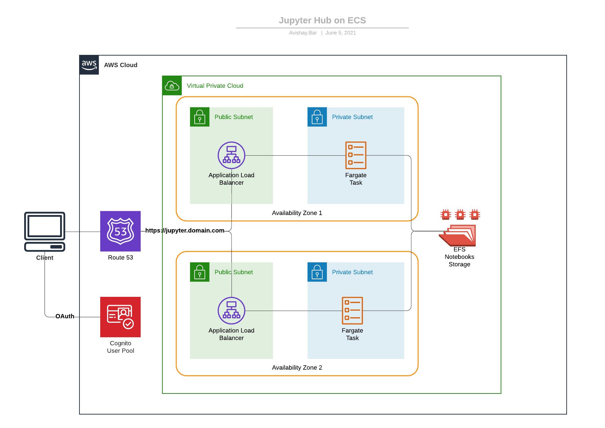

# Welcome to Jupyter ECS Service CDK project!

This is a project for deploying Jupyter Hub on ECS with CDK.

The `cdk.json` file tells the CDK Toolkit how to execute your app.

This project is set up like a standard Python project.  The initialization
process also creates a virtualenv within this project, stored under the `.venv`
directory.  To create the virtualenv it assumes that there is a `python3`
(or `python` for Windows) executable in your path with access to the `venv`
package. If for any reason the automatic creation of the virtualenv fails,
you can create the virtualenv manually.

## Architecture

The main idea behind this service is to use serverless services in order to remove the need from managing servers.
This architecture is using EFS as a shared, persistent storage for storing the Jupyter notebooks.



## Usage

### Pre-requisites

- Domain name managed with a public hosted zone on AWS Route 53. 
  Please collect this information and fill the `config.yaml` file with the hosted zone name and hosted zone id from Route 53.
- MacOS / Linux computer with Docker: https://docs.docker.com/get-docker/
- NodeJS 12 or later AWS CDK command line interface installed on your computer.
  You can easily install AWS CDK command line interface it using `npm`:

  ```
  $ npm install -g aws-cdk
  ```
- Python 3.6 and up with Pipenv dependencies & virtual environment management framework.
  You can easily install Pipenv command line interface it using `pip`:
  
  ```
  $ pip install --upgrade pipenv
  ```

### Preparing the CDK Environment

To initiate the virtualenv on MacOS and Linux and install the required dependencies:

```
$ pipenv install --dev
```

After the init process completes, and the virtualenv is created, you can use the following
step to activate your virtualenv.

```
$ pipenv shell
```

At this point you can now synthesize the CloudFormation template for this code.

```
$ cdk synth
```

To add additional dependencies, for example other CDK libraries, just add
them to your `setup.py` file and run `pipenv --lock && pipenv sync`
command.

### Deployment

You can now deploy the CloudFormation template:

```
$ cdk deploy
```

Don't forget to approve the template and security resources before the deployment.
By default, the template will provision 2 tasks to spawn between the availability zones for high availability.
If you would like to change the number of running tasks ,you can configure it in the `config.yaml` file.

### Docker

In order for the service to run, the ECS service containers will pull the compatible container image and provision containers according to the desired capacity.
For your convenience, I published an image that contains the same code. However, for security concerns you will use your own image hosted on your private repository (ECR).
You can find the updated source code on the `docker` folder and build it yourself.

### Jupyter Admin User

The CDK stack will provision the jupyter administrator user according to the list provided on the `docker/admins` file.
The default user that ships with the public docker image is `jupyter`. 
However, if you're using your own docker image you can change the admin user list using the `docker/admins`.

## Security

- You should configure the admin user temporary password on the `config.yaml` file.
- Jupyter `Shutdown on logout` is activated, To make sure that ghost processes are closed.  
- ECS containers are running in non-privileged mode, according to the docker best practices.
- During the deployment time, the cdk stack will try to determine your public ip address automatically using `checkip.amazonaws.com`.
  Then, it would add only this ip address to the ingress rules of the security group of the public load balancer.
- TLS termination are being done on the application load balancer using A SSL certificate generated on the deployment time by CDK, with DNS record validation on the configured hosted zone.
- Elastic File System is encrypted with a CMK generated by AWS KMS. Key policy is restricted to the account identities.
- Permanent resources, such as EFS, CMK, and Cognito User Pool are defined to be destroyed when the stack is deleted.

## License

See [LICENSE.md](LICENSE.md) file.