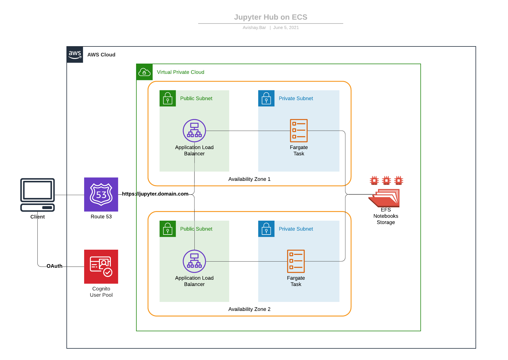

<a href="https://avishay.co.il" target="_blank" rel="noopener">
  
</a>

---


# Welcome to Jupyter ECS Service CDK project!

## Motivation

I found myself using Jupyter notebooks for various use-cases:
- Machine learning
- Data analysis & Visualisations
- Documentation

Recently, I started to work on a new project and found the need to deploy Jupyter in a way that it would be available for multiple users, authenticating with the corporate authentication tools and run notebooks without managing servers.

## Architecture

The main idea is to use serverless services in order to remove the need from managing servers.
This architecture is using EFS as a shared, persistent storage for storing the Jupyter notebooks.



## Usage

### Pre-requisites

- Domain name managed with a public hosted zone on AWS Route 53. 
  Please collect this information and fill the `config.yaml` file with the hosted zone name and hosted zone id from Route 53.
- MacOS / Linux computer with Docker: https://docs.docker.com/get-docker/
- NodeJS 20 or later with the AWS CDK v2 command line interface installed on your computer.
  You can easily install the AWS CDK command line interface using `npm`:

  ```
  $ npm install -g aws-cdk
  ```
- Python 3.9 and up. Dependencies can be managed either with plain `pip`
  (`requirements-dev.txt`) or with Pipenv.

  ```
  $ pip install --upgrade pipenv
  ```

### Required environment variables

This project no longer stores any secrets in `config.yaml`. The following
environment variables must be set at synth/deploy time:

| Variable | Required | Description |
| --- | --- | --- |
| `JUPYTER_ADMIN_TEMP_PASSWORD` | Yes | Cognito temporary password assigned to the admin users listed in `docker/admins`. The stack fails fast if it is not set. It must be changed on first login. |
| `DEPLOYER_IP_CIDR` | No | CIDR (e.g. `203.0.113.10/32`) allowed to reach the public load balancer on HTTPS. If unset, the deployer's public IP is resolved automatically via `checkip.amazonaws.com` at synth time. Set it explicitly for offline synth/CI. |

```
$ export JUPYTER_ADMIN_TEMP_PASSWORD='ChangeMeOnFirstLogin!'
$ export DEPLOYER_IP_CIDR='203.0.113.10/32'   # optional
```

### Preparing the CDK Environment

This project targets **AWS CDK v2** (`aws-cdk-lib` / `constructs`).

Using plain `pip` and a virtual environment:

```
$ python3 -m venv .venv
$ source .venv/bin/activate
$ pip install -r requirements-dev.txt
```

Alternatively, using Pipenv:

```
$ pipenv install --dev
$ pipenv shell
```

At this point you can synthesize the CloudFormation template for this code
(remember to export the required environment variables first):

```
$ cdk synth
```

You can run the unit tests with:

```
$ pytest --cov=cdk --cov-report=term-missing
```

To add additional dependencies, add them to `requirements.txt` /
`cdk/setup.py` (or the `Pipfile`) and reinstall.

### Deployment

You can now deploy the CloudFormation template:

```
$ cdk deploy
```

Don't forget to approve the template and security resources before the deployment.
By default, the template will spawn 1 task. I encountered some problems when trying to spawn more than 1 task during the OAuth flow.
If you would like to change the number of running tasks ,you can configure it in the `config.yaml` file.

### Docker

In order for the service to run, the ECS service containers will pull the compatible container image and provision containers according to the desired capacity.
For your convenience, I published an image that contains the same code. However, for security concerns you will use your own image hosted on your private repository (ECR).
You can find the updated source code on the `docker` folder and build it yourself:

```
$ cd docker
$ docker build -t jupyter-ecs-service .
$ docker tag jupyter-ecs-service your-docker-repo/jupyter-ecs-service:latest
$ docker push
```

### Jupyter Admin User

The CDK stack will provision the jupyter administrator user according to the list provided on the `docker/admins` file.
The default user that ships with the public docker image is `jupyter`. 
However, if you're using your own docker image you can change the admin user list using the `docker/admins`.

## Security

- The admin user temporary password is supplied via the `JUPYTER_ADMIN_TEMP_PASSWORD` environment variable (it is no longer stored in `config.yaml`).
  Note that this temporary password is rendered into the synthesized CloudFormation template on the deployer's machine (it is **not** committed to this repository).
  Treat the generated template/artifacts as sensitive, and change the password on first login.
- Authentication to the Jupyter hub is done by AWS Cognito user pool. When a user is logging in to the system, a user directory is automatically created for him.
- Jupyter `Shutdown on logout` is activated, To make sure that ghost processes are closed.  
- ECS containers are running in non-privileged mode, according to the docker best practices.
- During the deployment time, the cdk stack will try to determine your public ip address automatically using `checkip.amazonaws.com`.
  Then, it would add only this ip address to the ingress rules of the security group of the public load balancer.
- TLS termination are being done on the application load balancer using A SSL certificate generated on the deployment time by CDK, with DNS record validation on the configured hosted zone.
- Elastic File System is encrypted with a CMK generated by AWS KMS. Key policy is restricted to the account identities.
- Permanent resources, such as EFS, CMK, and Cognito User Pool are defined to be destroyed when the stack is deleted.

## License

See [LICENSE.md](LICENSE.md) file.